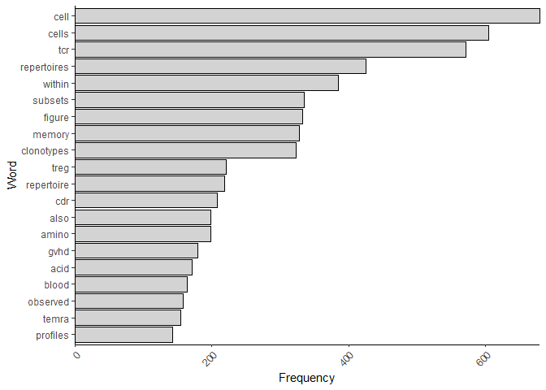
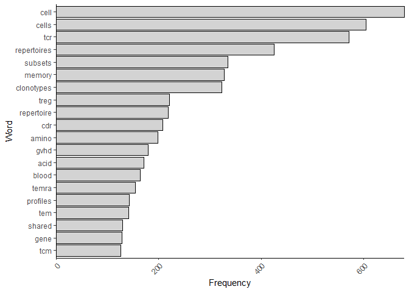
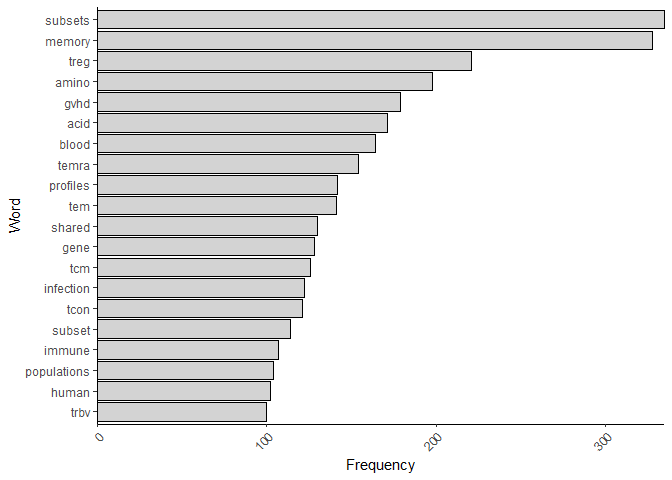
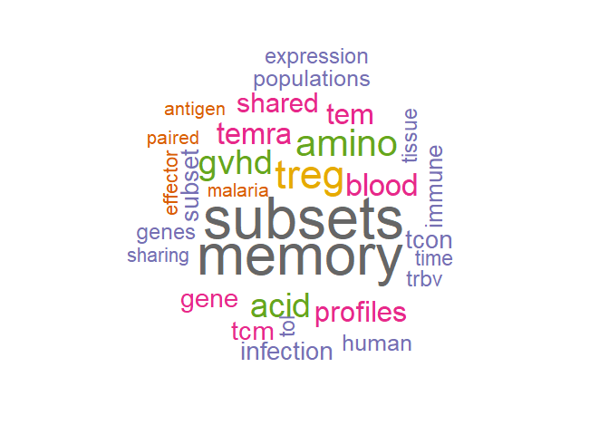
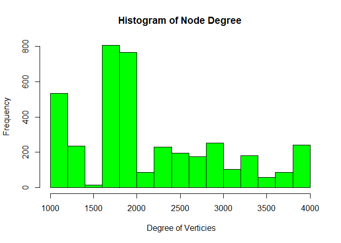
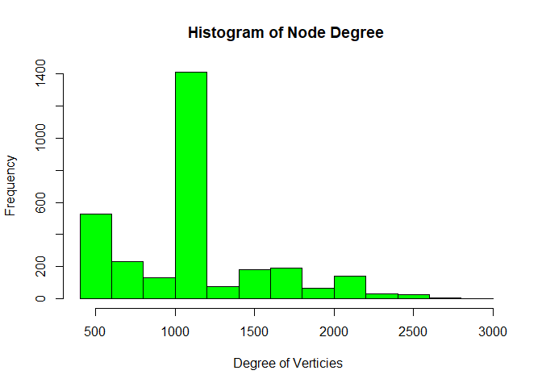
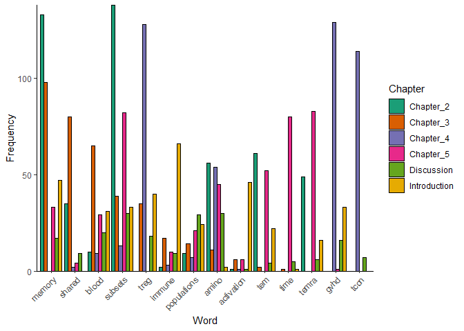
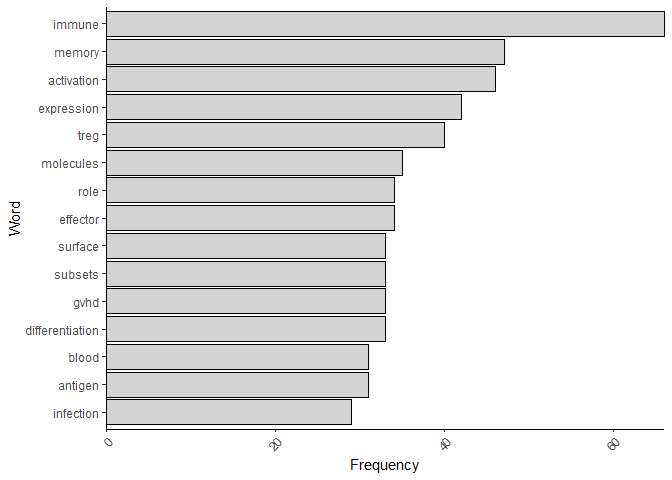

Text\_Mining
================
Tom Watkins
2020-07-07

### The idea behind this piece of work was to explore the most widely used words within each chapter of my PhD thesis.

``` r
# Setting the directory of the documents required for analysis. This work will be based off txt. versions of each individual chapter. 
docs=Corpus(DirSource('/Users/Tom Watkins/Documents/R Tutorials/NLP/Documents/'))

# Initial processing to remove a large number of specific characters and stopwords. 
# content_transformer will permit creation of a specific function that facilitates this removal.
# It is a basic gsub function that permits substitution of a user-defined character for a space.
toSpace = content_transformer(function(x,pattern) {return(gsub(pattern,' ',x))})


# Applying the above function to remove a number of specific characters
docs = tm_map(docs, toSpace,'-')
docs = tm_map(docs, toSpace,':')
docs = tm_map(docs, toSpace,'"')
docs = tm_map(docs, toSpace,"'")

# Next, all punctuation is removed
docs = tm_map(docs,removePunctuation)

# Tetx must be all lower case as R is case-specific
docs = tm_map(docs,content_transformer(tolower))

# For this analysis the digits will be stripepd also
docs = tm_map(docs, removeNumbers)

# Lastly, removing stopwords and whitespace 
docs = tm_map(docs, removeWords, stopwords('english'))
docs = tm_map(docs, stripWhitespace)
```

### Initial analysis will be carried out on the word use of the enitre document to determine whether there are additional words that need to be removed

``` r
# Generating a document-term matrix
dtm = DocumentTermMatrix(docs)

# Given the data is now in the above format we can perform quantitative assessment. 

# Calculating the frequency of total counts over all docs for each term
freq = colSums(as.matrix(dtm))
# Ordering words by most frequent 
ord=freq[order(freq,decreasing = T)]
# The most frequent words within all chapters
head(ord)
```

    ##        cell       cells         tcr repertoires      within     subsets 
    ##         680         605         572         425         385         335

``` r
# Formatting for plotting
Results_Data_Frame<- data.frame(Word = names(ord),Frequency=ord)

ggplot(Results_Data_Frame[1:20,],aes(y=reorder(Word,Frequency),x=Frequency)) + 
  geom_bar(stat='identity',colour='black',fill='lightgrey') + 
  ylab('Word') +
  scale_x_continuous(expand=c(0,0)) +
  theme_classic() +
  theme(axis.text.x = element_text(angle=45,hjust=1))
```



``` r
print(Results_Data_Frame[1:50,])
```

    ##                    Word Frequency
    ## cell               cell       680
    ## cells             cells       605
    ## tcr                 tcr       572
    ## repertoires repertoires       425
    ## within           within       385
    ## subsets         subsets       335
    ## figure           figure       333
    ## memory           memory       328
    ## clonotypes   clonotypes       323
    ## treg               treg       221
    ## repertoire   repertoire       219
    ## cdr                 cdr       208
    ## also               also       199
    ## amino             amino       198
    ## gvhd               gvhd       179
    ## acid               acid       171
    ## blood             blood       164
    ## observed       observed       158
    ## temra             temra       154
    ## profiles       profiles       142
    ## tem                 tem       141
    ## using             using       138
    ## shared           shared       130
    ## gene               gene       128
    ## tcm                 tcm       126
    ## compared       compared       124
    ## infection     infection       122
    ## however         however       121
    ## sequencing   sequencing       121
    ## specific       specific       121
    ## tcon               tcon       121
    ## diversity     diversity       118
    ## use                 use       118
    ## subset           subset       114
    ## data               data       113
    ## differences differences       113
    ## number           number       110
    ## immune           immune       107
    ## populations populations       104
    ## human             human       102
    ## trbv               trbv       100
    ## expression   expression        96
    ## increased     increased        95
    ## analysis       analysis        94
    ## genes             genes        94
    ## samples         samples        93
    ## tissue           tissue        92
    ## tol                 tol        91
    ## pubmed           pubmed        90
    ## time               time        87

#### There are still a number of largely generic words that could be removed from the above analysis e.g. within, figure, observed etc. As such, further processing is carried out:

``` r
Words_to_remove = c('within','figure','also','observed','using','compared','however','specific','use','data','differences','number','increased','analysis','samples','pubmed','increased')

docs2 = tm_map(docs, removeWords, Words_to_remove)
dtm2 = DocumentTermMatrix(docs2)
# Calculating the frequency of total counts over all docs for each term
freq2 = colSums(as.matrix(dtm2))
# Ordering words by most frequent 
ord2=freq2[order(freq2,decreasing = T)]
# Formatting for plotting
Results_Data_Frame2<- data.frame(Word = names(ord2),Frequency=ord2)

ggplot(Results_Data_Frame2[1:20,],aes(y=reorder(Word,Frequency),x=Frequency)) + 
  geom_bar(stat='identity',colour='black',fill='lightgrey') + 
  ylab('Word') +
  scale_x_continuous(expand=c(0,0)) +
  theme_classic() +
  theme(axis.text.x = element_text(angle=45,hjust=1))
```



#### Another round:

``` r
Words_to_remove2=c('cdr','cell','cells','tcr','repertoires','clonotypes','repertoire','sequencing','diversity','significant','changes','across','calculated','immunol','multiple','following','sequences','signficantly','abundant','non','can','show','capable')

docs3 = tm_map(docs2, removeWords, Words_to_remove2)
dtm3 = DocumentTermMatrix(docs3)
# Calculating the frequency of total counts over all docs for each term
freq3 = colSums(as.matrix(dtm3))
# Ordering words by most frequent 
ord3=freq3[order(freq3,decreasing = T)]
# Formatting for plotting
Results_Data_Frame3<- data.frame(Word = names(ord3),Frequency=ord3)

ggplot(Results_Data_Frame3[1:20,],aes(y=reorder(Word,Frequency),x=Frequency)) + 
  geom_bar(stat='identity',colour='black',fill='lightgrey') + 
  ylab('Word') +
  scale_x_continuous(expand=c(0,0)) +
  theme_classic() +
  theme(axis.text.x = element_text(angle=45,hjust=1))
```



### Generating a wordcloud to visualise in other ways

``` r
set.seed(01) # for reproducibility
wordcloud(words = Results_Data_Frame3$Word, freq = Results_Data_Frame3$Frequency,
          max.words=30, random.order=FALSE, rot.per=0.2, 
          colors=brewer.pal(8, "Dark2"))
```



### Network analysis of word associations.

``` r
dtm3_matrix=as.matrix(dtm3)

# converting each word that is present multiple times within a docuemnt to 1  
dtm3_matrix[dtm3_matrix>1] = 1
# creating a term-term matrix to probe the pairing of words
term_term_matrix=t(dtm3_matrix) %*% dtm3_matrix
# converting into a graph
Graph=graph.adjacency(term_term_matrix,weighted = T, mode ='undirected')
# removing loops i.e. same word twice
Graph = simplify(Graph)
# setting labels and degrees of the verticies so that each word is a verticies and each pair an edge
# degree is the number of connections between terms, so how many times it occurs in the data we have
V(Graph)$label = V(Graph)$name
V(Graph)$degree = degree(Graph)
# creating a historgram of node degrees
hist(V(Graph)$degree,
     col='green',
     main='Histogram of Node Degree',
     ylab='Frequency',
     xlab= ' Degree of Verticies')
```



Each word tends to have a lot of degrees (connections). As such, a network graph is likely not the best choice for further visualisation. A potential option however is to trim dtm3 to look at only the rarest words.

``` r
dtm3_matrix=as.matrix(dtm3)
dtm3_df=as.data.frame(dtm3_matrix)

# removing all words that are present  >5 times collectively
dtm3_trimmed=as.matrix(dtm3_df[,!colSums(dtm3_df) >5])

# creating a term-term matrix to probe the pairing of words
term_term_matrix_trimmed=t(dtm3_trimmed) %*% dtm3_trimmed
# converting into a graph
Graph_trimmed=graph.adjacency(term_term_matrix_trimmed,weighted = T, mode ='undirected')
# removing loops i.e. same word twice
Graph_trimmed = simplify(Graph_trimmed)
# setting labels and degrees of the verticies so that each word is a verticies and each pair an edge
# degree is the number of connections between terms, so how many times it occurs in the data we have
V(Graph_trimmed)$label = V(Graph_trimmed)$name
V(Graph_trimmed)$degree = degree(Graph_trimmed)
# creating a historgram of node degrees
hist(V(Graph_trimmed)$degree,
     col='green',
     main='Histogram of Node Degree',
     ylab='Frequency',
     xlab= ' Degree of Verticies')
```



There are still a huge number of verticies for each word, which reflects the repetitive nature of a thesis in some respects. Network analysis is therefore likely not possible.

### Chapter specific analysis:

``` r
All_Words=as.data.frame(as.matrix(dtm3[1:6,1:ncol(dtm3)]))
All_Words_t = data.frame(t(All_Words))
colnames(All_Words_t) = c('Chapter_2','Chapter_3','Chapter_4','Chapter_5','Discussion','Introduction')

Top.C2=(All_Words_t[order(All_Words_t$Chapter_2,decreasing = T),][1:3,])
Top.C3=(All_Words_t[order(All_Words_t$Chapter_3,decreasing = T),][1:3,])
Top.C4=(All_Words_t[order(All_Words_t$Chapter_4,decreasing = T),][1:3,])
Top.C5=(All_Words_t[order(All_Words_t$Chapter_5,decreasing = T),][1:3,])
Top.D=(All_Words_t[order(All_Words_t$Discussion,decreasing = T),][1:3,])
Top.I=(All_Words_t[order(All_Words_t$Introduction,decreasing = T),][1:3,])

Top.C2.C3=rbind(Top.C2[!(rownames(Top.C2) %in% rownames(Top.C3)),],Top.C3)
Top.C2.C3.C4=rbind(Top.C4[!(rownames(Top.C4) %in% rownames(Top.C2.C3)),],Top.C2.C3)
Top.C2.C3.C4.C5=rbind(Top.C5[!(rownames(Top.C5) %in% rownames(Top.C2.C3.C4)),],Top.C2.C3.C4)
Top.C2.C3.C4.C5.D=rbind(Top.D[!(rownames(Top.D) %in% rownames(Top.C2.C3.C4.C5)),],Top.C2.C3.C4.C5)
Top.C2.C3.C4.C5.D.I=rbind(Top.I[!(rownames(Top.I) %in% rownames(Top.C2.C3.C4.C5.D)),],Top.C2.C3.C4.C5.D)

Top.C2.C3.C4.C5.D.I$Word = rownames(Top.C2.C3.C4.C5.D.I) 
Melted=reshape2::melt(data=Top.C2.C3.C4.C5.D.I,id.var='Word')

# Specify word order depending on chapter of interest
Variable_Order=Melted[order(-subset(Melted,
                                    variable == 'Chapter_3')$value),]$Word

# Plotting
ggplot(Melted,aes(x=Word,y=value)) +geom_bar(stat='identity',position='dodge',
                                             color='black',aes(fill=variable)) +
  scale_x_discrete(limits = Variable_Order) +
  scale_y_continuous(expand=c(0,0)) +
  labs(fill='Chapter') +
  ylab('Frequency') +
  theme_classic() +
  theme(axis.text.x = element_text(angle=45,hjust=1)) +
  scale_fill_brewer(palette = 'Dark2')
```



### Plotting the most frequent words of each chapter individually

``` r
Chapter='Introduction'
nWords=15

Chapter_Interest=data.frame(All_Words_t[,which(colnames(All_Words_t) == Chapter)])
rownames(Chapter_Interest) = rownames(All_Words_t)
colnames(Chapter_Interest) = 'Frequency'
Chapter_Interest$Word=rownames(Chapter_Interest)
Chapter_Interest = Chapter_Interest[order(Chapter_Interest$Frequency,decreasing = T),]
Chapter_Interest = Chapter_Interest[1:nWords,]

ggplot(Chapter_Interest,aes(y=reorder(Word,Frequency),x=Frequency)) +
  geom_bar(stat='identity',colour='black',fill='lightgrey') + 
  ylab('Word') +
  scale_x_continuous(expand=c(0,0)) +
  theme_classic() +
  theme(axis.text.x = element_text(angle=45,hjust=1))
```


